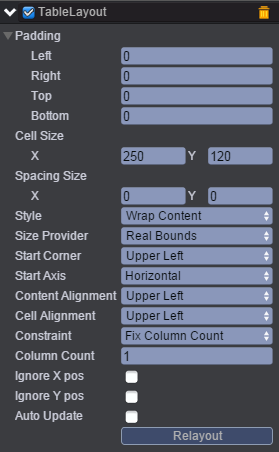
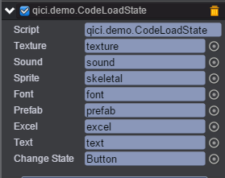

# 资源加载

* 本范例演示加载各种类型的资源。<br>


## UI

* 在新建场景中创建一个EmptyNode，作为各类资源按钮的父亲节点。在此节点上添加一个TableLayout组件，自动排列各类资源按钮。设置列表每格大小为250\*250；如下图：<br>

* 在node节点下创建一个Image作为show，当触发加载贴图事件，将贴图资源添加到Image上。
* 在node节点下创建7个Button，分别为texture、sound、skeletal、font、prefab、excel和text。点击按钮触发加载对应的资源事件。
* 在根节点先创建一个Button，点击按钮触发切换场景事件。
* 创建脚本CodeLoadState.js，负责加载资源的事件，脚本挂在根节点上。将各类的资源按钮节点拖拽到对应的属性上，如下图：<br>
<br>
代码如下：<br>

```
var CodeLoadState = qc.defineBehaviour('qici.demo.CodeLoadState', qc.Behaviour, function() {
	// TODO: Constructor
	var self = this;
	self.texture = null;
	self.sound = null;
	self.sprite = null;
	self.font = null;
	self.prefab = null;
	self.excel = null;
	self.text = null;
	self.changeState = null;
}, {
	// TODO: Serializer
	texture : qc.Serializer.NODE,
	sound : qc.Serializer.NODE,
	sprite : qc.Serializer.NODE,
	font : qc.Serializer.NODE,
	prefab : qc.Serializer.NODE,
	excel : qc.Serializer.NODE,
	text : qc.Serializer.NODE,
	changeState : qc.Serializer.NODE,
});

Object.defineProperties(CodeLoadState.prototype,{
	// TODO: define properties
});

CodeLoadState.prototype.awake = function() {
	var self = this;
	
	// 加载贴图
	self.texture.onDown.add(function() {
		self.game.assets.load('background_texture', 'Assets/texture/sourcesBackground.bin', function() {
			self.game.world.find('UIRoot/node/show').texture = self.game.assets.find('background_texture');
		});
	});
	
	// 加载声音
	self.sound.onDown.add(function() {
		self.game.assets.load('sound', 'Assets/audio/newlevel.mp3.bin', function() {
			var soundCtrl = self.sound.find('Sound');
			if (!soundCtrl.audio) {
				soundCtrl.audio = self.game.assets.find('sound');
			}
			soundCtrl.play();
		});
	});

	// 加载精灵
	self.sprite.onDown.add(function() {
		self.game.assets.load('sprite', 'Assets/sprites/panda.bin', function() {
			var spriteCtrl = self.sprite.find('Sprite');
			if (!spriteCtrl.texture) {
				spriteCtrl.texture = self.game.assets.find('sprite');
			}
			spriteCtrl.playAnimation('atk2', 1, false);
		});
		
	});

	// 加载字体
	self.font.onDown.add(function() {
		self.game.assets.load('font', 'Assets/font/HK.bin', function() {
			var textCtrl = self.font.find('UIText');
			if (textCtrl.fontFamily !== qc.UIText.WEBFONT) {
				textCtrl.fontFamily = qc.UIText.WEBFONT;
				textCtrl.font = self.game.assets.find('font');
			}
		});
	});

	// 加载预置
	self.prefab.onDown.add(function() {
		self.game.assets.load('prefab', 'Assets/prefabs/prefab.bin', function() {
			self.game.add.clone(self.game.assets.find('prefab'), self.prefab.find('list'));
		});
		
	});

	// 加载Excel表格数据
	self.excel.onDown.add(function() {
		self.game.assets.load('excel', 'Assets/excel/mother.bin', function() {
			var excelAsset = self.game.assets.find('excel');
			self.excel.find('UIText').text = "sheet's name:" + excelAsset.sheetsName.join(',');
		});
		
	});

	// 加载Text内容
	self.text.onDown.add(function() {
		self.game.assets.load('text', 'Assets/excel/mario_map.bin', function() {
			var textAsset = self.game.assets.find('text');
			self.text.find('UIText').text = "text's content:" + textAsset.text;
		});
		
	});

	 // 加载场景
	self.changeState.onDown.add(function() {
		self.game.scene.load('ReferenceLoad');
	});
};	
```
