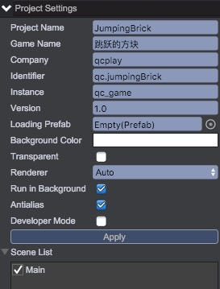

# 创建工程与场景
考虑到游戏中的逻辑和界面比较简单，使用的资源比较少，故而将所有的界面都置于一个场景中，避免场景切换带来的消耗。
先创建工程JumpingBrick和空的主场景Main，因为游戏大量的使用白色作为背景，为了减少绘制消耗，直接设置游戏背景色为白色。设置如下：  


## 游戏入口与游戏初始化
在Scripts目录下创建入口脚本：JumpingBrick.js。代码如下：

````javascript
window.JumpingBrick = qc.JumpingBrick = {
	// 初始化各个模块
    // 数据管理及持久化处理
    data: null,
    // 界面切换管理
    uiManager: null,
    // 游戏世界
    gameWorld: null,
    // 游戏控制
    gameControl: null,
    // 游戏配置
    gameConfig: null,
    // 游戏结束界面
    gameOver: null,
    // 排行榜
    announcement: null
};

// 游戏逻辑初始化
qc.initGame = function(game) {
    // 记录下游戏实例方便访问
    JumpingBrick.game = game;

    JumpingBrick.game.time.frameRate = 30;
};
````
 设置此脚本为入口脚本：  
 <video controls="controls" src="../video/entry_script.mp4"></video>  
 首先设置命名空间，并记录game实例，并预设各个模块的管理对象。默认游戏帧率设为30。
